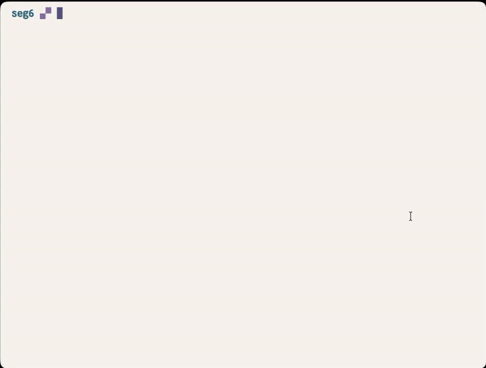

# ws

<div align="center">
  
</div>

#### example tmux configuration

```
# recommended: split window (most responsive)
bind -n M-s split-window -v -l 12 "ws pick"
bind -n M-d split-window -v -l 12 "ws kill"
bind -n M-b run-shell "ws back"

# alternative: popup (slightly slower)
# bind -n M-s display-popup -E -w70% -h60% "ws pick"
# bind -n M-d display-popup -E -w70% -h60% "ws kill"
```
